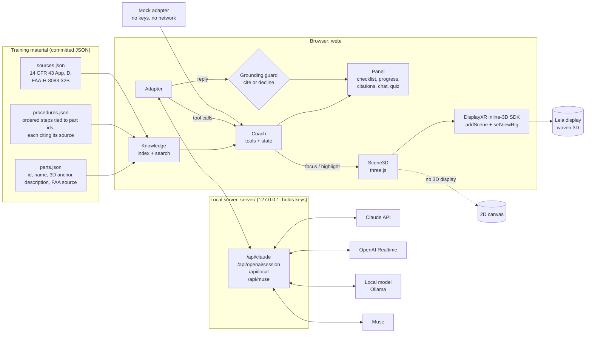

# 3D Maintenance Coach: Aviation

**A glasses-free 3D aircraft maintenance trainer: an AI instructor flies the view to each engine part
and walks a trainee through a 100-hour inspection on a Leia display, or in 2D in any browser.**

> [!WARNING]
> **Training demo only. Not approved maintenance data.** Follow the aircraft, engine and propeller
> manufacturers' maintenance instructions, and work under a certificated mechanic. Nothing here is
> authorization to perform maintenance.

> **Demo GIF: placeholder.** Record it on a Leia display and save it as `docs/demo.gif`, then replace
> this note with ``. A phone video of the display shows the
> depth; a screen capture would only show the flat 2D view.

**Live (2D, mock instructor):** https://joehillthunder.github.io/displayxr-aviation-coach/

## What it shows

- **A real-scale engine in glasses-free 3D.** A horizontally opposed piston engine (your phone scan of
  a real engine bay, or the built-in trainer engine) woven by the
  [DisplayXR inline-3D SDK](https://github.com/DisplayXR/displayxr-web). The instructor flies a camera
  rig from part to part with `setViewRig`, converging on the part it is talking about so it sits on
  the glass.
- **An AI instructor with tools, not just a chat box.** `focus_part`, `highlight_part`, `next_step`,
  `prev_step`, `explain_step`, `quiz_me` and `show_source` drive the 3D view, the checklist and the
  citations.
- **Grounded answers.** The instructor answers only from `parts.json` and `procedures.json`. Every
  reply must cite the material, a guard replaces uncited claims with *"That's not in the training
  material."*, and specific values (torques, gaps, intervals) are always deferred to the manufacturer.
- **Four procedures with sources.** The 100-hour engine and nacelle inspection (every item of
  14 CFR 43 Appendix D (d)), spark plug inspection, oil and filter inspection, and propeller inspection.
  Each step cites its Appendix D item or its FAA-H-8083-32B chapter and page.
- **Trainee and quiz modes.** Guided step-by-step, or "find the part": the instructor names a part
  and the trainee clicks it on the model.
- **Crisp 2D over woven 3D.** Part labels, the step checklist, the source citation and a progress
  bar are ordinary DOM over the woven canvas.
- **Field mode.** A local small model and the browser's own speech, with no internet.

## Hardware

| | |
|---|---|
| 3D display | A Leia SR display (laptop or monitor) with the DisplayXR runtime |
| Browser | [DisplayXR Browser](https://github.com/DisplayXR/displayxr-browser/releases) for woven 3D; any modern browser for 2D |
| OS | Windows 10/11 (the DisplayXR stack is Windows) |
| Optional | A mic for voice; [Ollama](https://ollama.com/) for offline mode; an Anthropic or OpenAI key for the live instructors |

Without a 3D display, everything runs in 2D, including the AI instructor, the quiz and calibration.

## Quick start (2 minutes, mock mode, no keys)

```bat
git clone https://github.com/joehillthunder/displayxr-aviation-coach
cd displayxr-aviation-coach
setup-windows.bat
```

`setup-windows.bat` installs Node.js LTS with winget if it is missing, runs `npm install` (which copies
three.js, Spark and the DisplayXR SDK into `web/vendor/`, so nothing loads from a CDN), creates `.env`
from `.env.example`, runs the tests in mock mode, then starts the server and opens
<http://localhost:8080/>. Open the same URL in the DisplayXR Browser for 3D.

Then try:

1. **Procedure → Spark plug inspection**, then **Next step**. The view flies to each part.
2. Ask *"where are the magnetos?"*, then *"what is the torque for the propeller bolts?"* (it won't give
   one, and it tells you which step covers it).
3. Switch to **Quiz** and click the part it names.

Prefer the terminal? `npm run mock` is the same instructor as a CLI. On macOS or Linux, `npm install && npm start`.

## Architecture



- **One coach, many adapters.** Every adapter (`web/app/instructor/adapters/`) calls the same tool
  implementations (`session.js`), and every reply goes through the same guard (`Coach.ground`). Tests
  (`test/`) run all four procedures end to end in mock mode and check the guard against invented
  answers and invented citations.
- **The server builds the prompt.** The system prompt and tool schemas are generated on the server from
  the committed data (`tools.js`), never accepted from the page; keys live only in `.env`.
- **Camera rig, metre scale.** The engine is authored in metres, so the rig's real eye separation
  gives honest depth; convergence follows the focused part and never comes nearer than 0.55 m (the
  runtime's comfort rule). The eyes hang off the app camera (the SDK's attach pattern), so fly-to has
  no stereo lag.

## Adapters

Pick one in the **Instructor** menu (or `?ai=claude` etc.). Unconfigured ones are greyed out.

| Adapter | Needs | Notes |
|---|---|---|
| Mock | nothing | Rule-based, deterministic, offline. Default, and the only one on GitHub Pages. |
| Claude | `ANTHROPIC_API_KEY` | One Messages API turn per request on `claude-opus-5-5` (`CLAUDE_MODEL`, `CLAUDE_EFFORT`), with server-side refusal fallback. The browser runs the tools and keeps the history append-only. |
| OpenAI Realtime (voice) | `OPENAI_API_KEY` | WebRTC speech-to-speech. The server mints a short-lived client secret with the instructions and tools preset. Because the audio is generated by the service, the guard can only check the transcript after it has been spoken. |
| Offline (local model) | Ollama running (`ollama pull qwen3:8b`) | Any OpenAI-compatible endpoint (`LOCAL_LLM_URL`, `LOCAL_LLM_MODEL`). Same tools and guard; no internet. |
| Muse | API details | **Stub.** `server/server.mjs` → `POST /api/muse` returns 501 until the Muse endpoint, auth and tool-call format are filled in. |

**Offline / field mode:** run the local model, choose *Offline (local model)*, and tick *Read replies
aloud* (the browser's speech synthesis uses the OS voices, which work offline). Browser speech
*recognition* in Chrome and Edge needs the network, so in a disconnected hangar type your questions.

## Your scan

Drop a phone-captured splat of a real engine bay into `web/assets/scans/`, list it in
`manifest.json`, then press **K** (Calibrate) and click the model to place each part's anchor.
Step by step: [`web/assets/scans/README.md`](web/assets/scans/README.md). Asset licenses:
[`web/assets/LICENSES.md`](web/assets/LICENSES.md).

## Repository map

```
web/                  the static app (deployed to GitHub Pages)
  data/               parts.json, procedures.json, sources.json  <- the training material
  app/scene.js        DisplayXR camera rig, fly-to, highlight, picking, label projection
  app/trainer-engine.js  procedural opposed-four engine (fallback asset)
  app/instructor/     knowledge, coach + grounding guard, tool schema, adapters
  assets/scans/       your scan + manifest + calibrated anchors
server/server.mjs     local server: static files + keyed API proxies (127.0.0.1 only)
cli/coach.mjs         mock instructor in the terminal
test/                 data integrity, grounding, mock end to end (node --test)
```

## Glasses-free 3D for MRO and flight-school training

*For simulation and training partners.*

Maintenance training has a spatial problem. A trainee has to learn where things are on an engine (which
magneto feeds which plug, what the baffles do, where an exhaust crack hides) and today that knowledge
comes from flat pictures in a manual or from scarce time on a real aircraft. Headsets fix the depth but
isolate the trainee from the instructor, the manual and the classroom, and they don't suit a shared
bench or a quick refresher between jobs.

A glasses-free 3D display at a training station sits in between:

- **Depth without gear.** The engine has real depth on an ordinary desk-sized screen. Nothing to put
  on, clean or charge, and an instructor can stand behind the trainee and see the same thing.
- **3D and 2D together.** Checklists, citations and labels stay crisp 2D over the woven 3D, so the
  procedure and the part are in one view, and the same app runs in 2D on any classroom PC.
- **An instructor that shows, not tells.** The AI moves the view to the part it is talking about,
  quizzes by pointing, and cites the regulation or handbook section for every step.
- **Grounded and auditable.** Content lives in plain JSON your training department owns. The model may
  only answer from it, and the tests fail if a step loses its source.
- **Your own aircraft.** Swap the trainer engine for a phone scan of your own fleet's engine bay and
  re-anchor the parts in minutes, with no 3D artist.
- **Works disconnected.** A local model and on-device speech cover a hangar with no network.

Natural fits: Part 147 AMT schools, flight-school maintenance departments, MRO onboarding and recurrent
training, and simulator centres that want a bench-top companion to full procedures trainers. To pilot
this with your curriculum (your procedures, your scans, your hardware), open an issue.

## License

Code: [Apache-2.0](LICENSE). Assets keep their own licenses: [`web/assets/LICENSES.md`](web/assets/LICENSES.md).
Procedure text is paraphrased from public FAA material (14 CFR Part 43 Appendix D; FAA-H-8083-32B) for
training; no manufacturer manual text, logos or product branding are included.
